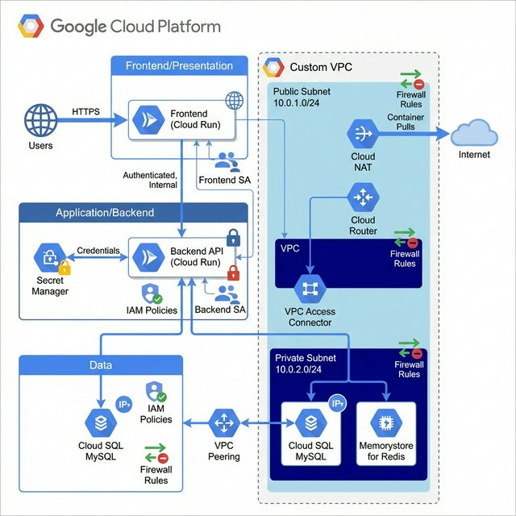

# GCP 3-Tier Architecture Lab

A comprehensive hands-on lab for learning Google Cloud Platform infrastructure deployment using Terraform. This lab teaches Infrastructure as Code (IaC) principles by deploying a production-ready 3-tier architecture.



## 🎯 What You'll Build

- **Presentation Tier**: Public Cloud Run frontend service
- **Application Tier**: Private Cloud Run backend API with VPC connectivity
- **Data Tier**: Cloud SQL MySQL database and Memorystore Redis cache
- **Networking**: Custom VPC with public/private subnets, Cloud NAT, firewall rules
- **Security**: Service accounts, IAM policies, Secret Manager integration

## 🎓 Learning Objectives

After completing this lab, you will understand:

- How to structure Terraform projects with reusable modules
- GCP networking fundamentals (VPC, subnets, NAT, firewall rules)
- Serverless architecture with Cloud Run
- Private service connectivity in GCP
- Database and cache deployment with managed services
- Security best practices (least privilege IAM, secret management)
- Infrastructure as Code workflows

## 🚀 Quick Start

### Prerequisites

- GCP account with billing enabled
- Terraform >= 1.5.0 installed
- gcloud CLI installed and authenticated

### Setup

1. **Clone or navigate to this directory**
   ```bash
   cd gcp-terraform
   ```

2. **Follow the detailed setup guide**
   ```bash
   cat SETUP.md
   ```

3. **Configure your variables**
   ```bash
   cp terraform.tfvars.example terraform.tfvars
   # Edit terraform.tfvars with your project ID
   ```

4. **Deploy the infrastructure**
   ```bash
   terraform init
   terraform plan
   terraform apply
   ```

5. **Access your application**
   - Frontend URL will be displayed in the outputs
   - Visit the URL to see the deployed application

6. **Clean up when done**
   ```bash
   terraform destroy
   ```

## 📁 Project Structure

```
gcp-terraform/
├── main.tf                      # Root module orchestration
├── variables.tf                 # Input variables
├── outputs.tf                   # Output values
├── versions.tf                  # Terraform version constraints
├── terraform.tfvars.example     # Example configuration
├── build-and-push.sh            # Build and deploy apps to GCR
├── docker-compose.yml           # Local testing environment
├── apps/
│   ├── backend/                 # Node.js API (Express + MySQL + Redis)
│   ├── frontend/                # React web app
│   └── README.md                # Application documentation
├── modules/
│   ├── networking/              # VPC, subnets, NAT, firewall
│   ├── security/                # Service accounts, IAM
│   ├── cloudsql/                # MySQL database
│   ├── redis/                   # Memorystore cache
│   ├── cloudrun-frontend/       # Public frontend service
│   └── cloudrun-backend/        # Private backend service
├── diagrams/
│   └── architecture.png         # Architecture diagram
└── docs/
    ├── LEARNING_OBJECTIVES.md   # Detailed learning goals
    ├── ARCHITECTURE.md          # Architecture deep dive
    ├── DEPLOYMENT_GUIDE.md      # Step-by-step deployment
    ├── TROUBLESHOOTING.md       # Common issues and solutions
    └── CLEANUP.md               # Resource cleanup guide
```

## 🎮 Try It Locally

Test the complete 3-tier architecture on your machine:

```bash
# Start all services (frontend, backend, MySQL, Redis)
docker-compose up

# Visit http://localhost:3000
# - See real-time visitor statistics
# - Watch Redis caching in action
# - View MySQL-stored visitor data
```

**What you'll see:**
- 🌐 Beautiful React frontend
- ⚡ Fast API responses (Redis caching)
- 💾 Persistent data storage (MySQL)
- 📊 Real-time statistics dashboard

## 🏗️ Architecture Overview

This lab implements a **3-tier architecture**:

### Tier 1: Presentation (Frontend)
- **Cloud Run** service with public internet access
- Serves the user interface
- Communicates with backend API

### Tier 2: Application (Backend)
- **Cloud Run** service with private access only
- Connected to VPC via **Serverless VPC Access Connector**
- Handles business logic and data processing
- Accesses database and cache through private networking

### Tier 3: Data
- **Cloud SQL MySQL**: Primary database with private IP only
- **Memorystore for Redis**: In-memory cache for performance
- Both services isolated in private subnet

### Supporting Infrastructure
- **Custom VPC**: Isolated network environment
- **Cloud NAT**: Allows private services to access internet for updates
- **Secret Manager**: Secure credential storage
- **Service Accounts**: Separate identities with least-privilege access
- **Firewall Rules**: Network security controls

## 📚 Documentation

- **[SETUP.md](SETUP.md)**: Prerequisites and initial GCP setup
- **[docs/LEARNING_OBJECTIVES.md](docs/LEARNING_OBJECTIVES.md)**: What you'll learn
- **[docs/ARCHITECTURE.md](docs/ARCHITECTURE.md)**: Detailed architecture explanation
- **[docs/DEPLOYMENT_GUIDE.md](docs/DEPLOYMENT_GUIDE.md)**: Step-by-step deployment
- **[docs/TROUBLESHOOTING.md](docs/TROUBLESHOOTING.md)**: Common issues and solutions
- **[docs/CLEANUP.md](docs/CLEANUP.md)**: How to destroy resources

## 💰 Cost Considerations

This lab uses:
- Cloud Run (pay-per-use, free tier available)
- Cloud SQL `db-f1-micro` instance (~$7-10/month)
- Memorystore Redis BASIC tier 1GB (~$36/month)
- VPC Access Connector (~$11/month)
- Cloud NAT (minimal usage)

**Estimated monthly cost**: ~$50-60 if left running 24/7

**Cost-saving tips**:
- Run `terraform destroy` when not in use
- The lab can be redeployed in ~10-15 minutes
- Most expensive component is Redis - consider destroying between sessions

## 🔒 Security Features

- **Network Isolation**: Private subnets for data tier
- **No Public IPs**: Database and cache accessible only from VPC
- **Service Accounts**: Separate identities per service
- **Least Privilege IAM**: Minimal permissions for each component
- **Secret Management**: Credentials stored in Secret Manager
- **Transit Encryption**: Redis configured with TLS
- **Firewall Rules**: Explicit allow-list approach

## 🎉 Next Steps

After deploying the infrastructure:

1. **Explore the architecture** - Review the created resources in GCP Console
2. **Deploy your application** - Replace default container images with your own
3. **Test connectivity** - Verify frontend can reach backend, backend can reach database
4. **Review logs** - Check Cloud Run logs for service behavior
5. **Experiment** - Try modifying the infrastructure and redeploying

## 📖 Additional Resources

- [Terraform Google Provider Documentation](https://registry.terraform.io/providers/hashicorp/google/latest/docs)
- [Google Cloud Run Documentation](https://cloud.google.com/run/docs)
- [Cloud SQL Best Practices](https://cloud.google.com/sql/docs/best-practices)
- [VPC Networking Guide](https://cloud.google.com/vpc/docs)

## 🤝 Contributing

This is a learning lab. Feel free to:
- Extend it with additional features
- Add monitoring and alerting
- Implement CI/CD pipelines
- Add load testing scenarios

---

**Happy Learning! 🚀**
